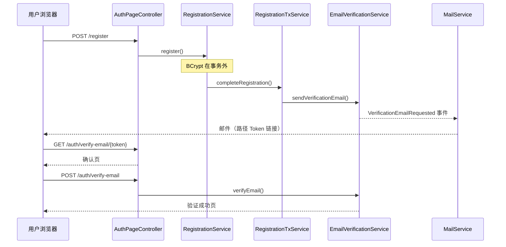

# Org Auth — 架构说明

本文档描述认证模块的包结构、请求流程与关键设计决策，供团队作为 **标准范式** 复制与扩展。

## 1. Maven 多模块结构

```
org/                         父 POM（JaCoCo 聚合、SpotBugs 门禁）
├── org-auth-core/           领域、服务、仓储、Flyway 迁移
├── org-auth-web/            Controller、Security、Thymeleaf、OpenAPI
├── org-auth-starter/        Spring Boot 自动配置（对外嵌入入口）
├── org-app/                 可运行应用 + 全部集成/单元测试
├── demo-business/           嵌入示例（OrgAuthSecurityCustomizer + /dashboard）
└── org-coverage/            JaCoCo 聚合报告与覆盖率门禁（无源码）
```

依赖方向：`core ← web ← starter ← app / demo-business`。业务系统只需依赖 `org-auth-starter`，并实现 `OrgAuthSecurityCustomizer` 追加 URL 授权规则（见 [EXTENSION.md](EXTENSION.md)）。

Starter 装配要点：

| 类 | 职责 |
|----|------|
| `OrgAuthCoreAutoConfiguration` | JPA 扫描、领域 Bean、Flyway 先于 EMF |
| `OrgAuthWebAutoConfiguration` | Web 层 Bean（`@ConditionalOnWebApplication`） |
| `OrgAuthAutoConfiguration` | 聚合上述两者 |

## 2. 包结构（逻辑边界）

```
com.skyline.org
├── common/          跨域基础设施（响应、异常、工具、i18n、Web 辅助）
├── user/            用户域（User、Role、仓储、默认角色缓存）
├── auth/            认证域（见下表）
├── mail/            邮件发送适配
└── config/          应用级配置（Flyway、Cache、Async、OpenAPI）
```

### auth 子包职责

| 包 | 职责 |
|----|------|
| `audit` | 安全事件结构化日志（`AUTH_AUDIT`） |
| `config` | SecurityFilterChain、限流 Filter、AuthProperties |
| `controller` | Thymeleaf 页面 + REST API（v1） |
| `dto` | 请求/响应模型 |
| `entity` | 认证相关 JPA 实体（Token、LoginAttempt） |
| `event` | 域事件（验证/重置邮件） |
| `lock` | 账户锁定策略 |
| `ratelimit` | 可插拔限流后端（memory / redis） |
| `repository` | 认证仓储 |
| `schedule` | 定时清理过期数据 |
| `security` | UserDetails、登录成功/失败 Handler |
| `service` | 业务编排（注册、验证、重置、校验） |
| `validation` | 格式与强度校验规则 |

## 3. 核心请求流

### 3.1 注册与邮箱验证



### 3.2 表单登录与 Session

- 认证方式：Spring Security 表单登录 + **JDBC Session**（支持多实例）
- Session 策略：`changeSessionId` 防 fixation；同一用户最多 3 个会话
- 失败处理：`LoginFailureHandler` 记录尝试、审计、Flash 友好消息
- 锁定：`LoginAttemptService` → `AccountLockService`（5 次 / 15 分钟）

### 3.3 动态校验 API

- 路径：`/api/v1/auth/check/{username|email|password}`
- 编排：`AvailabilityCheckService`（格式校验 + 可选 DB 查询 + Caffeine 负缓存）
- 生产：`app.auth.check.enumeration-safe=true` 时不查库，仅返回格式有效

## 4. 数据与迁移

- **Flyway**：`V1__init_auth_schema.sql`（用户/角色/Token/登录尝试）、`V2__spring_session.sql`
- **JPA**：`ddl-auto=validate`，表结构以 Flyway 为准
- **FlywayMigrationConfig**：在 JPA `EntityManagerFactory` 之前执行迁移（故 `spring.flyway.enabled=false`）

## 5. 配置 Profile

| Profile | 用途 |
|---------|------|
| `dev` | 本地开发，完整 check 枚举、内存限流 |
| `test` | 集成测试，`TestAsyncConfig` 同步邮件 |
| `prod` | 环境变量注入、enumeration-safe、forward headers |
| `redis` | 可选，`app.auth.rate-limit.backend=redis` |

## 6. 扩展点

| 需求 | 建议接入点 |
|------|------------|
| 新业务 URL | 实现 `OrgAuthSecurityCustomizer` 追加授权规则 |
| OAuth2 / JWT | 新增 `security` 配置链，保留现有 User 域 |
| 自定义角色 | 扩展 `RoleService` + Security 表达式 |
| 分布式限流 | 启用 `redis` profile（见 EXTENSION.md 语义说明） |
| 审计落库 | 订阅 `AuthAuditService` 或 AOP 包装 |

详见 [EXTENSION.md](EXTENSION.md) 与 [SECURITY.md](SECURITY.md)。
